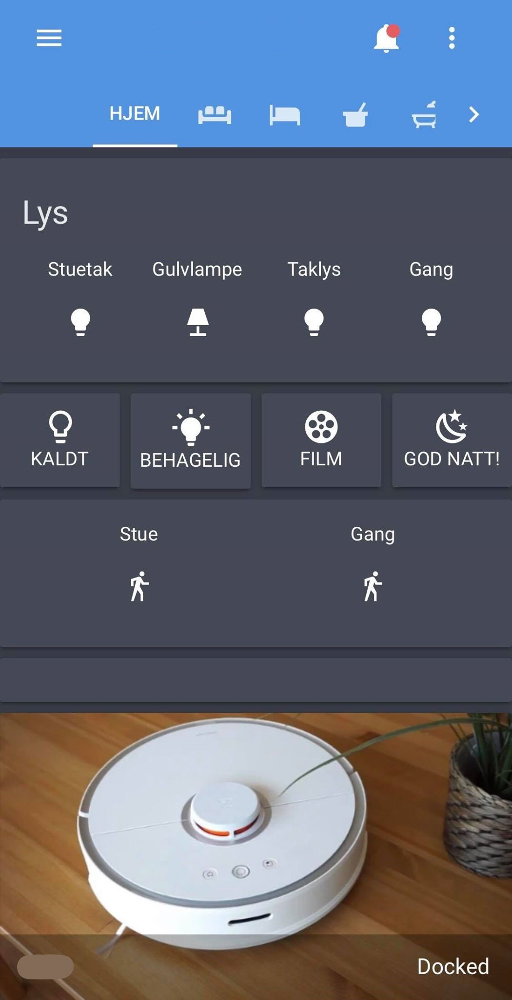
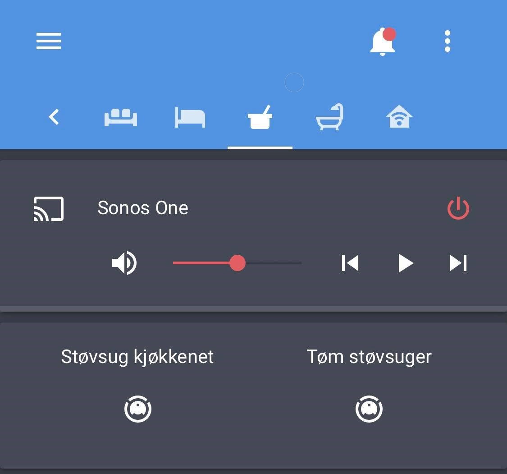
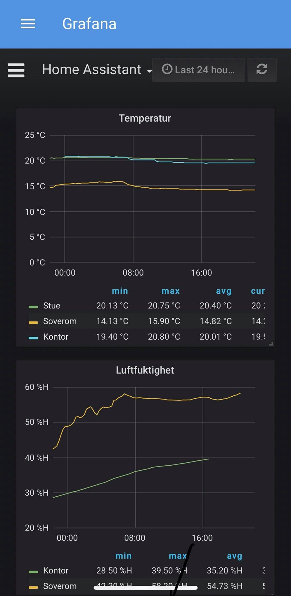

## Info
This is the live working copy of my smart home. Im currently using a server running Ubuntu Server 18.04 LTS with Docker. 

## Containers

- Home Assistant: duh
- Grafana: makes pretty graphs. Pulls data from InfluxDB 
- InfluxDB: database for storing history
- Organizr: Easy way to have everything organized. Does also include Nginx, which can be used as a reverse proxy. Deals with client certs and SSL.
- Mosquitto: MQTT broker
- Node-RED: Flow-based automation
- Portainer: GUI for managing containers and stuff related to Docker
- Watchtower: keeps other containers up-to-date automatically

And a couple of more, but those are not relevant to this repo.

## Hardware

- Aeotec Z-Stick Gen 5 Z-Wave
- Philips Hue Hub
- Sonos One, with Alexa support
- HP z420 computer
    - Intel Xeon E5-1620, 4 cores @3.6GHz
    - 16GB DDR3 ECC @ 1600MHz
    - GTX 570
    - Samsung (?) 250GB SSD 
    - Some random 3TB HDD
- NAS with ∼10TB of usable space

## Installation

Check out how I did it:
- [Install Docker](docs/1_INSTALL_DOCKER.md)
- [Configure containers](docs/2_CONFIGURE_CONTAINERS.md)
- [Securing connection](docs/3_SECURE_CONNECTION.md)
- [Backup](docs/4_BACKUP.md)
- [Troubleshooting](docs/9_TROUBLESHOOTING.md)

## Screenshots

